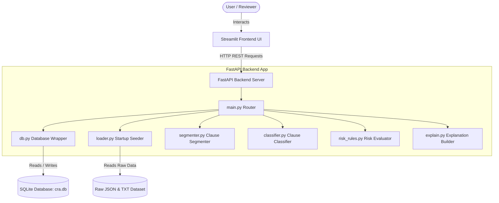
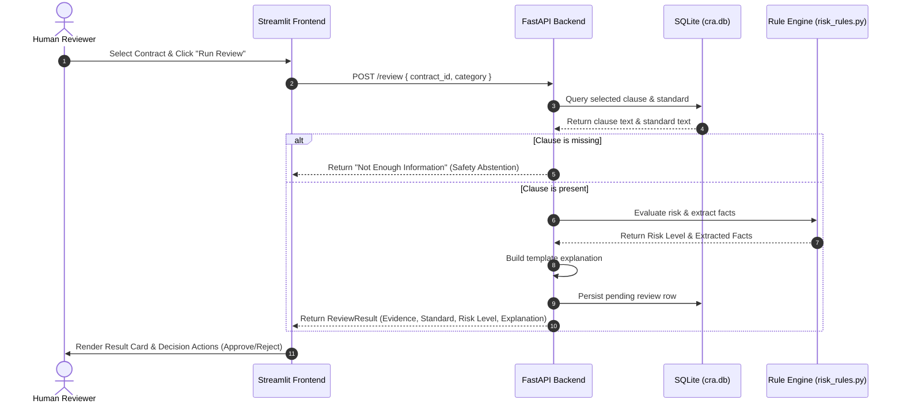
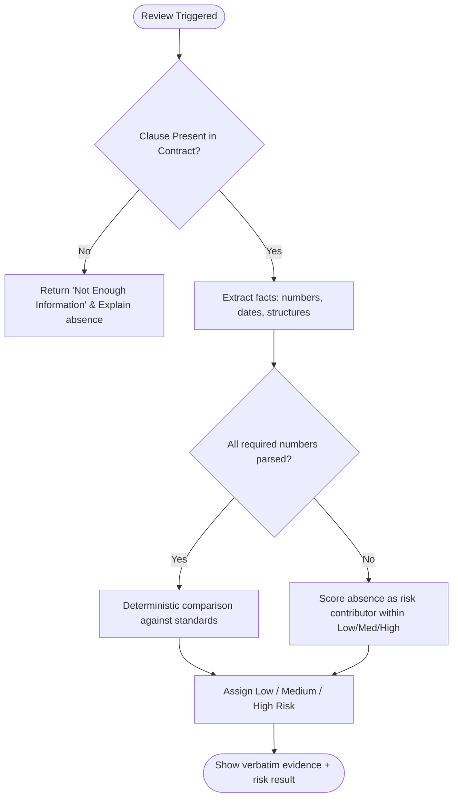

# Architecture & Workflow Diagrams

This document contains Mermaid diagrams illustrating the Contract Review Assistant (CRA) architecture, the core data flow, and how the deterministic safety engine ensures safe assessments.

## 1. System Architecture

## 2. Review Request Pipeline (Data Flow)

## 3. Safety Abstention Logic (Anti-Hallucination Guard)

